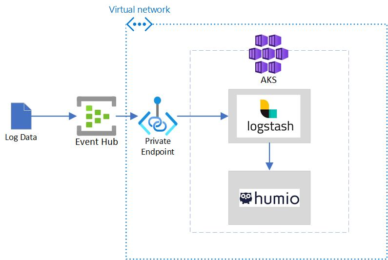

# EventHub Data to Humio using LogStash
This repo demonstrates how to move Azure EventHub data to Humio using Logstash.



Separate GitHub Actions workflows for each component are provided. They should be deployed in the following order:

1. **Infrastructure (terraform.yml)** - this creates the EventHub and AKS cluster. The EventHub connection string, name and consumer group are needed to configure logstash.
2. **Humio (humio-helm-deploy.yml)** - This deploys the Humio helm chart. A repository and ingest token should be created manually within Humio.
3. **Logstash (logstash-helm-deploy.yml)** - This deploys logstash and connects it to the other two components. 

## Infrastructure

GitHub Actions and Terraform are used to deploy a Private AKS Cluster and an EventHub with a Private Endpoint. The VNET deployed for the cluster is intended to be used as a spoke in a hub and spoke deployment.

## EventHub

A single namespace is deployed with one EventHub named 'logging'. A consumer group named 'logstash' is also created.

Event producers must be within the VNET to reach the namespace.

## Humio

Humio is also deployed via Helm. A repository can be manually created along with an ingest token. The Humio Web interface can be exposed with a load balancer service. The URL of this service and the ingest token must be supplied to logstash via the configuration file.


## LogStash

OSS Logstash is deployed using Helm. This repo contains a logstash configuration template

```
# /usr/share/logstash/pipeline/logstash.conf
# cat logstash.template.conf | envsubst '${EH_CSTR} ${EH_NAME} ${EH_CONSUMER_GROUP} ${HUMIO_URL} ${HUMIO_INGEST_TOKEN}'  > logstash.conf
input{
  azure_event_hubs{
    event_hub_connections => ["${EH_CSTR};EntityPath=${EH_NAME}"]
    threads => 16
    decorate_events => true
    consumer_group => "${EH_CONSUMER_GROUP}"
    initial_position => "end"
  }
}

output {
  http {
    format => "json"
    content_type => "application/json"
    http_compression => true
    http_method => "post"
    url => "${HUMIO_URL}/services/collector/raw"
    headers => ['Authorization', 'Splunk ${HUMIO_INGEST_TOKEN}']
  }
}
```

The tokens are replaced with values from environment variables as part of the GitHub actions workflow. Repository Secrets are used to protect sensitive values.

```
      - name: Update logstash config
        run: cat logstash.template.conf | envsubst '${EH_CSTR} ${EH_NAME} ${EH_CONSUMER_GROUP} ${HUMIO_URL} ${HUMIO_INGEST_TOKEN}'  > logstash.conf
        working-directory: ./logstash
```

The updated template is used to create a kubernetes secret:

```
      - name: Update logstash secret
        run: kubectl -n ${{ env.TARGET_NAMESPACE }} create secret generic logstash-conf --from-file=logstash.conf --dry-run -o yaml | kubectl apply -f -
        working-directory: ./logstash
```

The secret is referenced in the values file used to deploy the Helm chart

```
image: "docker.elastic.co/logstash/logstash-oss"
secretMounts:
  - name: logstashconf
    secretName: logstash-conf
    path: /usr/share/logstash/pipeline
```